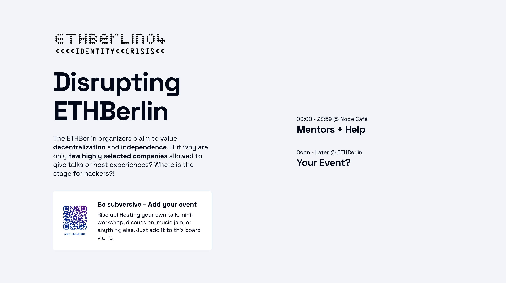

# Disrupting ETHBerlin Through Aggressive Non-Compliance

The organizers of ETHBerlin claim to value **decentralization** and **independence**. But why are only **few highly selected companies** allowed to give talks or host experiences? Where is the stage for hackers?!

Core values of ETHBerlin have been violated.

**They must be restored.**



## Motivation and Story

<!-- prettier-ignore-start -->
> [!IMPORTANT]
> [View the slides](./slides/Disrupting%20ETHBerlin.pdf) before continuing for context.
<!-- prettier-ignore-end -->

Our motivation for this hackathon was to make an immediate impact. We wanted to build something that would make ETHBerlin better for everyone.

Something we quickly noticed was that although there were many so-called "experiences", none of them were organized by hackers like me. They all came from big crypto companies (who probably had to pay for the privilege).

What about "decentralization"?

We were frustrated that there wasn't a platform for co-creation. The whole event was all about consumption, against its stated spirit. We saw sponsored experiences, lots of consumerism, and tasty food.

We immediately started talking to people about it and slowly came up with an idea: A board in a central place where people could add their own mini-events like discussions, workshops or even lectures.

And since we are web3, we wanted to do it digitally. But how?

### Unique approach for immediate impact

We knew that coding would take too long. We needed to move quickly to make an impact.

So the first thing we did was build a **static figma mockup** showing some existing events and a telegram QR code.

Through some undisclosed means, we got it onto **all the big screens at ETHBerlin**, so people would notice and use it immediately.


We quickly cloned a random [Telegram bot boilerplate](https://github.com/AlexMubarakshin/ts-telegraf-boilerplate) which logged the inputs to the console, so we could receive new events. Once this was done people could add events on their own – and we **updated the mockup by hand**.

At the same time, we began working on a full-blown Next application and building out the bot's functionality - until we could **replace the mockup with a working version**.

Around the same time, the **Open Source Orchestra** had their jam at The Patio – and the **screens advertised it all around ETHBerlin** so that as many people as possible could join or watch this co-created experience.

ETHBerlin was **not amused** by the **aggressive non-compliance**, and they **took the board down** after a few hours. But the work continues, with the goal of **bringing hackers together**.

## Technologies

### Frontend

The code for the frontend is living at `/frontend` and uses the following technologies:

- TypeScript
- Next.js
- React
- Tailwind

=> Simple Next.js application with only one screen

### Backend

You can find the backend code in the `src` folder.

It uses the following technologies:

- TypeScript
- Node.js
- Telegram with [Telegraf](https://github.com/telegraf/telegraf)

Events are currently persisted in a flat file to keep things simple. The Telegram bot currently supports only one operation, which is creating new events.

To keep things simple, all event values are currently modeled as strings. In the future it makes sense to use more appropriate data types like a combination of `startTime` and `duration` represented as dates or numbers.

### Why Telegram? 🤨

As we said above, the goal of this project was to have an immediate impact. There are a lot of interesting technologies out there, but they're no good if nobody uses them.

Everyone in web3 has Telegram, but probably no one uses Matrix.

But because the bot interface is purely textual, it will be fairly easy to build integration with other platforms like Matrix in the future.

### What about privacy and decentralization? 🤔

We don't worry about privacy or decentralization until we've solved the problem.

There are many ways to implement privacy and decentralization for a project like this, but they are not a focus for us under strict time constraints.

But of course we want to develop these ideas in the near future - we're in web3 after all.

## Future Work

As we wrote above, there are a few things to tackle from a technical standpoint:

- Integrate with platforms like Matrix
- Implement better privacy and decentralization measures through cryptography (zk) and/or blockchain tech
- Possibly integrate the backend into the Next.js app
- Address use cases like editing or updating events.

But there's one thing we're really passionate about that isn't technical. **And that is seeing this project used at other events.**

Be it week-long residencies like [ZuBerlin](https://www.zuberlin.city/) or future hackathons like the next ETHBerlin – it's time that co-creation becomes an integral part of events in web3.

---

## Local Development

Check out the **[live demo](https://ethbln.uber.space/)**

1. Clone this repository:

   ```bash
   git clone https://github.com/remarcable/disrupting-ethberlin.git
   ```

2. Install dependencies

   ```bash
   cd disrupting-ethberlin && npm i
   cd disrupting-ethberlin/frontend && npm i
   ```

3. Copy the `.env.example` file to `.env` and update the values. Add your [Telegram API token](https://core.telegram.org/bots/tutorial) and [your user id](https://medium.com/block-bastards/how-to-find-your-user-id-on-telegram-a27cb7b732d6):

   ```bash
   cp .env.example .env
   cp frontend/.env.example .env
   ```

4. Run the backend:

   ```bash
   npm run dev
   ```

5. Run the frontend:

   ```bash
   cd frontend
   npm run dev
   ```

Open up localhost:3001 to view the schedule. Open up your Telegram bot to create events.

## Deployment

### Frontend

As this is a basic Next.js app, you can follow the [Next.js](https://nextjs.org/docs/app/building-your-application/deploying) docs for instructions on how to deploy the frontend.

### Backend

- `npm run build`
- `npm start`
